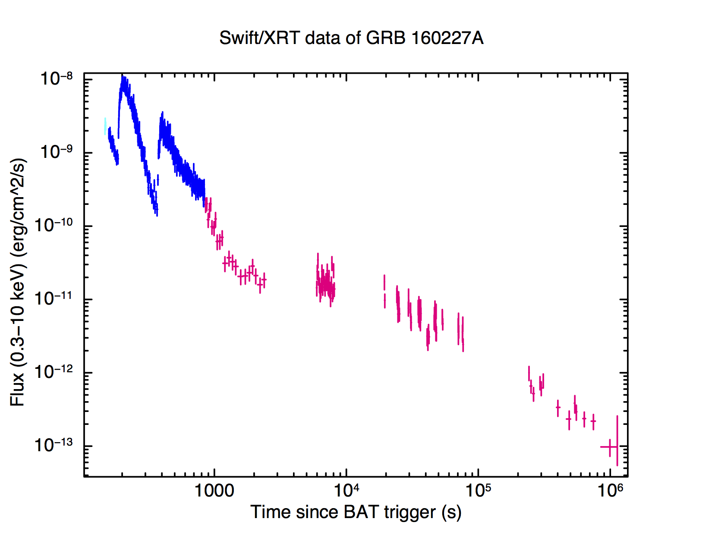
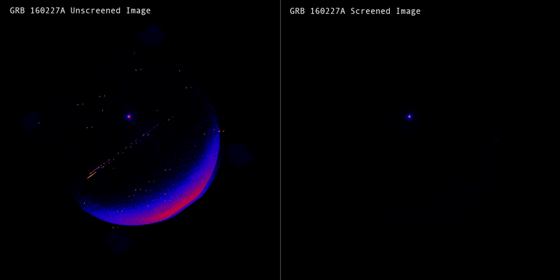

##########################
*Swift* -XRT Data Analysis 
##########################

.. contents::
	:local:

Windows Timing & Photon Counting
================================

*Swift*-XRT has two modes, Windowed Timing (WT) and Photon Counting (PC).

The Windowed Timing mode is obtained by binning 10 rows into a single row, and then reading out only the central 200 columns of the CCD. The time resolution of this mode is 1.7 ms.

The Photon Counting mode retains full imaging and spectroscopic resolution but the time resolution is limited to 2.5 s.

Below is the light curve of GRB 160227A taken from `Swift UK data center`_, the blue part is from WT mode and the red part is observed by PC mode.

Type of Data File
=================

* Event file ``.evt``, the most important one, which contains the observational data. Swift website provides **screened event file** ``_cl.evt`` and **unscreened event file** ``_uf.evt``.

Download Data
=============

Generate Spectrum and Light=curve
=================================

.. _`Swift UK data center`: http://www.swift.ac.uk/xrt_curves/00676423/
