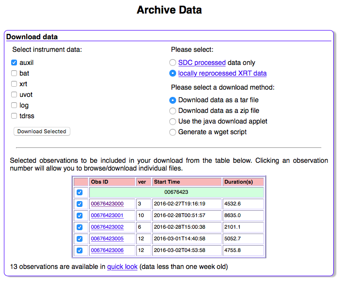

##########################
*Swift* -XRT Data Analysis 
##########################

.. contents::
	:local:

Two Modes: Windows Timing & Photon Counting
===========================================

*Swift*-XRT has two modes, Windowed Timing (WT) and Photon Counting (PC).

The Windowed Timing mode is obtained by binning 10 rows into a single row, and then reading out only the central 200 columns of the CCD. The time resolution of this mode is 1.7 ms.

The Photon Counting mode retains full imaging and spectroscopic resolution but the time resolution is limited to 2.5 s.

.. figure:: _image/160227A_XRT.png
	:align: center

	Light curve of GRB 160227A taken from `Swift UK data center`_, the blue part is from WT mode and the red part is observed by PC mode.


What kind of files do we need?
==============================

.. figure:: _image/compareEvt.png
	:align: center

	Unscreened (left) and screened (right) images of GRB 160227A.

*	**Event File** ``.evt``, the most important one, which contains the observational data. Swift website provides **screened event file** ``_cl.evt`` and **unscreened event file** ``_uf.evt``.

.. figure:: _image/wtg0to2eff.gif
	:align: center
	
	XRT Effective area curves for WT mode grade 0-2 and PC mode grade 0-12.


*	**Redistribution Matrix File** ``.rmf`` and  **Ancillary Response File** ``.arf``. The Redistribution Matrix gives the probabilities of an incoming photon of energy E will be detected in several detector's channels. The Ancillary Response Matrix gives the "effective area", the effective sensitivity area of the detector to photons of given energy" of the detector system, and usually includes such components as mirror vignetting, filters, etc.

 .. note::

		In some cases ``.arf`` and ``.rmf`` are supplemented, in the cases of BAT and UVOT, replaced by ``.rsp`` files.  A detailed 		description is available: `Definition of RMF and ARF file formats`_.


*	**Housekeeping File** ``.hk``, The Housekeeping file contains the information of satellite while observing the GRB, for instance, CCD temperature, voltage and etc.


*	**Attitude files** ``.sat`` ``.pat`` ``.uat``, The ``.sat`` file contains the attitude determined from the spacecraft star trackers. The ``.pat`` file is almost identical to the sat file, but the task ``attjumpcorr`` has been applied to it. From the point of view of XRT analysis, these files are indistinguishable. The attitude in the ``.uat`` file has been determined using the UVOT as a star tracker.


How to download data? 
=====================

1.	Select the GRB from `Swift Archive Download Portal`_, we choose 160227A for example.


	
	GRB 160227A Data Download Page

2.	Above figure show the download page with individual observations. If you want to download all the data for XRT analysis, select  "xrt" and "auxil" on the top-left and click "download selected", "xrt" has the XRT data and  "auxil" contains the satellite information. 

3.	Here we only need some necessary file for the early afterglow analysis. Those files are included in obs ID: **00676423000**, which contains the data till 4532.6s data after the GRB trigger. Click on "00676423000", a list of many files appear.

4.	First we download the event file ``sw00676423000xpcw3po_cl.evt`` of PC mode and ``sw00676423000xwtw2po_cl.evt`` of WT mode, and the housekeeping file ``sw00676423000xhd.hk``.

5.	Determine the ATTFLAG of the event file in order to select the attitude file::

		fkeyprint sw00676423000xpcw3po_cl.evt.gz ATTFLAG
 
		# FILE: sw00676423000xpcw3po_cl.evt.gz
		# KEYNAME: ATTFLAG
		# EXTENSION:    0
		ATTFLAG = '110     '           / Attitude type flag
		# EXTENSION:    1
		ATTFLAG = '110     '           / Attitude type flag
		# EXTENSION:    2
		# EXTENSION:    3
		# EXTENSION:    4

	``fkeyprint`` is used to print the keywori stored in FITS file, it displys ``ATTFLAG = 110``, which means the extension of attitude file is ``.pat``, so we shall download ``sw00676423000pat.fits``. The correspondence is ``100 = .sat file``, ``110 = .pat file``, ```111 = .uat file``, and ``101 = .uat file``.

6.	Response matrix files ``.rmf``, ``.arf`` and ``.rsp`` are not in this page, we will download and produce them when doing the spectrum analysis.


 .. hint::

     A perl script for downloading above files: `dlXRT`_


How to generate spectrum and light curve ?
==========================================


.. _`Swift UK data center`: http://www.swift.ac.uk/xrt_curves/00676423/
.. _`Definition of RMF and ARF file formats`: http://heasarc.gsfc.nasa.gov/docs/heasarc/caldb/docs/memos/cal_gen_92_002/cal_gen_92_002.html
.. _`Swift Archive Download Portal`: http://www.swift.ac.uk/swift_portal/
.. _`dlXRT`: _script/dlXRT.html
